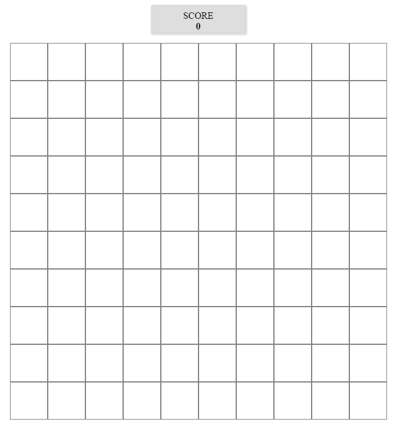
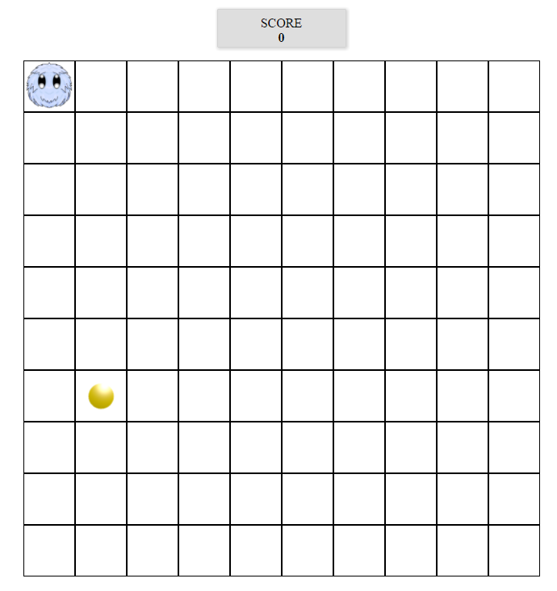

# Furry Game

## Setup

Remember to:
- Run ```npm init``` command
- Install appropriate modules
- Set Webpack - the input file should be `js/app.js`, the output `js/out.js`


## How does this workshop work?

### "Furry collects coins" - the game

The aim of this exercise is to write a simple Javascript game. While working on this task, you will learn the technique
of object oriented programming and you will learn why using objects, their methods and properties makes sense. :-)

The hero of our game is **Furry** who moves on a board with the size of 10x10 fields.

There is a coin in a random field of the board. The player controlling Furry with arrow keys on the keyboard must move Furry to the coin. When he does that, the coin disappears from the board and appears in a different field (also random), and the player gets 1 point.

If the player hits a wall, the game ends: the board disappears and, as it usually happens in computer games, the text "GAME OVER" appears.

At any time during the game, the player must see how many coins he has collected.

Here you can view a sample solution: https://marcin-barylka.github.io/js-furry-solution/

## Let's begin!

### 1. Building a board

**Score:**
* Take a look at `index.html`. You will find there a section named ```score```. The section is styled. We will need it to show the user his points.

**Board:**
* In `index.html` you will also find many empty `<div>` elements. There are exactly 100 of them. These will be the fields of a square board with the size  of 10x10 fields.
* Look at`style.css` in the `css` directory. You will find there a prototype of a stylesheet for your game. Link the CSS file to the HTML document.
* In `index.html`, place all`<div>` elements in the `<section>` element so that one `<section>` element contains all 100 `<div>`s. Give the section a `#board` id.
* Add the following properties to `<div>` elements placed within the element with the `#board` id:
    * width 64px and height 64 px,
    * 1 px wide border of any color you want,
    * place all elements next to each other.
* Add the following styles to the `#board` element:
    * width 640px and height 640px,
    * place the whole element in the center of the screen and move it away from the top edge.

Take a lookat `index.html` in your browser. If you did everything right, you should see a square board with the size of 10x10 fields.

The board should look more or less like the one on the screen:


## 2. Preparation of game graphics elements

Look in the `images` catalog. You will find two images in it:
* `furry.png` -- the hero of our game,
* `coin.png` -- object of our hero's desire ;-)

Create two classes in the CSS file:
* `.furry` which you will give the following properties:
    - background image `furry.png`,
    - block background repetition,
    - make the picture fill the whole background.
* `.coin` which you will give the following properties:
    - background image `coin.png`,
    - block background repetition,
    - make the picture fill the whole background.


## 3. Preparation of the `app.js` file

* In the main project directory, create a directory named `js`. Create an `app.js` file inside this directory.
* Link the result file that will be generated by Webpack to the HTML file - e.g. `out.js`. Place it at the end of the page before closing the body tag.
* In `app.js`, add e.g. `console.log('hello')`, run the console, and using Webpack generate the output file named `out.js`. Do you remember how to launch Webpack locally?

```JavaScript
./node_modules/.bin/webpack app.js out.js
```
*Jif you are in the main directory, remember to inform Webpack correctly where the app.js file is and where it should save the out.js file,
e.g. js/app.js and js/out.js*

* Open `index.html` in the browser and check if the text was written in the console.

## 4. Preparing constructor for Furry and the coin

* Create in `app.js`:
    * `Furry()` constructor and define the following properties of it:
        - `x`: position of Furry on the X axis,
        - `y`: position of Furry on the Y axis,
        - `direction`: direction of Furry's movement (this property will take one of the four values: `left`, `right`, `up` or `down`, but this will be dealt with later).

        Our hero will start from the upper left corner of the screen, and will go to the right. Set initial values for `x`, `y` and `direction`:

         ```JavaScript
         this.x = 0;
         this.y = 0;
         this.direction = "right";
         ```
    * `Coin()` constructor and define the following properties of it:
        - `x`: position of coin on the X axis,
        - `y`: position of coin on the Y axis.

        The drawn position of the coin does not change until it is collected by Furry. Therefore, it can be drawn right after it is created. We know that the board has a size of 10x10 fields (counted from 0 to 9). Using the hints below, in the constructor, give the `x` and` y` properties corresponding random values.

        Hint:
        ```javascript
        Math.floor(Math.random() * 10);
        ```

**Remember to use`this` keyword correctly within objects!**

## 5. Preparing an object controlling the game

* In `app.js`, create:

    * a `Game()` constructor that will store an instance of Furry, the coin, game board, and current score of the player. This object will also have methods for managing the game. Define the following properties of it:
        - `board`: place all board fields in it. Use known method that collects all `<div>` elements that is locate in the `<section>` element with a `#board` id,
        - `furry`: this property will represent the hero of the game. Set its value to `new Furry()`,
        - `coin`: this property will store the coin. Set its value to `new Coin()`. Note that immediately after creating a new coin, its x and y positions are ready,
        - `score`: this will be the current score of the player. Give it the value of 0.

## 6. Calculating position

Both Furry's and coin's positions on the board are given using the x and y properties. The list of game fields is kept in a one-dimensional array whose indices are in the range from 0 to 99. So how do you convert these two different ways of storing a position?

In `app.js` add a method to the `Game()` constructor that will convert the x and y position into an array index according to an appropriate formula.

Hint:
```javascript
this.index = function(x,y) {
  return x + (y * 10);
}
```

## 7. Drawing the board state

Since we have already defined elements of the game (Furry and the coin) and put them in the game (`furry` and `coin` properties in the `Game()` object), we should we should make show them in the appropriate fields of the board.

To show Furry, all you need to do is assign `.furry` class to a `<div>` element corresponding with Furry's x and y position. Then, proceed analogically with the coin.

* In the `Game()` constructor, write a method named `showFurry()` that will do it. Use the conversion method that you wrote in the previous section.

Hint:
```javascript
this.board[ this.index(this.furry.x,this.furry.y) ].classList.add('furry');
```

* In the `Game()` constructor, write a method named `showCoin()` that will show the coin. This method should work analogically to `showFurry()`.

* Create a game object and call `showFurry()` and `showCoin()` methods on it. Obviously, you should do it outside of the `Game()` constructor.

After the code has been processed by Webpack and the `index.html` file has been opened in the browser, the following scene should appear (remember that the coin may be in another field - its position is randomly drawn)



## 8. Start

As you have surely noticed in the demo of the game, Furry moves in a given direction ever if you do not control it. To apply the effect in your game, you will use `setInterval()`. In `app.js`, call `startGame()` method on the Game object.

Add `startGame()` method to the Game() constructor. Save the id that it returns in `this.idSetInterval` in a way that you can remove it at the end of the game. Set the second setInterval parameter to 250 ms. For now, make the function write "hooray from setInterval" in the console.log. Test if the text you enter is called in the console appropriately.

## 9. Modifying Furry position depending on the direction

We wrote the setInterval function to move Furry automatically. Let's do it then.

Until now, when defining Furry, we have determined that he will move to the right at the beginning, starting from the top left corner of the board. However, the goal of the game is to make Furry move in different directions.

We must therefore modify Furry's x and y position depending on the direction in which it moves. Note the `direction` property that we have already defined in its constructor. Therefore, we can write a method that will modify the `x` and` y` properties accordingly based on the value of the `direction` property.
In the Game constructor, add a `moveFurry()` method. Call it in the `setInterval()` function (where we have a console.log("hooray from setInterval") <= you can remove it already).

**ATTENTION:**
*So far we have used properties and metods of the `Game()` object and we have referred to them usingthe keyword `this`. In this case we cannot do this: within the event, the keyword `this` points to an event, not an object. To avoid this, create a variable e.g. named `self` and assign `this` to it before you declare the event. Now, you can use `self` inside the method that controls the keyboard.*

In `moveFurry()` method we will move Furry. Write an `if` instruction that will check the value of Furry's direction. E.g.:

Hint:
```javascript
 if(this.furry.direction === "right") {
     this.furry.x = this.furry.x + 1;
 } else if ( your conditions )
```

Think about which item value to modify and how to modify it if Furry has the direction set to left, down or bottom.
Before the end of the function, also call the `showFurry()` method.

For now, do not worry about Furry being able to go outside the board. We will deal with this a bit later.
But what else is wrong when you run the code in the browser? **Furry clones!!!.**

The explanation of this effect is very simple:

* Furry has the position (0, 0), we draw Furry in this position,
* We change Furry's position to (1, 0) and draw him in the new position,
* **BOOM!** It turns out that we have now two Furrys on the board, in positions (0, 0) and (1, 0),
* Therefore, it is necessary to remove Furry's image from the previous position.

## 9. Clearing the view - removing unnecessary classes

To clear the board (old furry position), in the Game constructor create a new method named `hideVisibleFurry()`. Find the `div` element with `furry` class in the function and remove this class from it. This method should be called at the beginning of `showFurry()` method. Remember to always search for just one element (the previous one) - use `document.querySelector('.furry')`.

Generate the `out.js` file and check the result in the browser.

## 10. Keyboard support.

The game should react to the arrow keys on the keyboard. In the `Game()` constructor, write a method that will take a variable named `event` as a parameter. This method will be used as a callback for for the `keydown` event.

To get the code of a pressed key, you need to use `which` property of the `event` object that is passed in the parameter.

To save you the tedious search for appropriate values for the arrow keys, here are their codes:
* **37**: left,
* **39**: right,
* **38**: up,
* **40**: down.

Modify Furry's direction of movement, depending on the pressed key. Use `direction` property of the `Furry()` with an appropriate value assigned to it: `"up"`, `"down"`, `"left"` or `"right"`.

Hint:
Set the observation of the keydown event in the `app.js` file.
```javascript
document.addEventListener('keydown', function(event){
    Game.turnFurry(event);
});
```

Example of direction change:
```Javascript
switch (event.which) {
  case 37:
    this.furry.direction = 'left';
    break;
  case 38: (....) //add the rest of the code.
```

## 11. Checking for collision with the coin

In the language of game developers, a collision between two elements takes place when the elements overlap on the screen. In our game, collision will occur when Furry's position is the same as the position of the coin.

Write a method that will check the position of both elements. If the collision occurs, you must:

* remove a coin from the screen (not from the game object),
* add 1 to the score,
* remember to show the score on the screen,
* create a new coin (thanks to the fact that we took care of it when writing the constructor, the new coin will have a randomly selected X and Y position).

**Remember that the coin is actually the `coin` property of the `Game()` object.**

In the `Game()` constructor, create a `checkCoinCollision()` method. Call it at the end of the `moveFurry()` method. This means that after each step we will check if there is a collision between Furry and the coin.

Steps of this method:
* Check if Furry's position is the same as the coin's. You must compare the x and y position.
* If the positions are the same:
    - remove coin class from current location,
    - increase the score by 1 point,
    - update the score in the element with score id on the page,
    - create a new coin object and assign it to this.coin,
    - call the `showCoin()` method.

## 12. hecking for collision with the wall

If Furry runs into the wall, the game ends. Collision with the wall occurs when:

    * the X position of Furry is less than zero or greater than 9,
    * the Y position of Furry is less than zero or greater than 9.

Write a method that will check for collision with the wall. Name it `gameOver()`. Call it in the `moveFurry()` method. We have to check if we have left the board at each step.

Steps of this method:
* Check if the Furry's position matches the description above (that is, its x  position is less than 0, etc.)
* If you establish this way that a collision occurs:
    - remove `setInterval()`,
    - call the `hideVisibleFurry` method.

    In addition, here you can plan a message to display at the end of the game showing the user's score.

**Possible problems:**
Here, you may encounter the problem of calling the gameOver() method too late. Think about where to put it in the `moveFurry()`. Or maybe it should return something, perhaps the game status?

## 13. Code structure

If you have reached this step, it means that your game works. Your structure should look like this:

```Javascript
// Furry constructor
var Furry = function() {
}
// coin constructor
var Coin = function() {
}
// game constructor
var Game = function() {

    this.index = function(x,y) {
    }

    this.showFurry = function() {
    }

    this.hideVisibleFurry = function() {
    }

    this.showCoin = function() {
    }

    this.moveFurry = function() {
    }

    this.turnFurry = function(event) {
    }

    this.checkCoinCollision = function() {
    }

    this.gameOver = function() {
    }

    this.startGame = function() {
    }
}

// Initializing
var game = new Game();
// calling the methods and the keydown event

```

## 14. Dividing code into modules

The next and final step is the division of our game into modules. Create the following files in the js directory:
    * coin.js
    * furry.js
    * game.js - here you will need the `Coin()` and `Furry()` constructors
    * app.js - you already have this file, you will need the `Game()` constructor here.

Divide your application accordingly by including the appropriate constructor in each module, e.g. you need to move the `Coin()` constructor to the `coin.js` module. Do it with other modules similarly. Remember to export and import modules then needed.

Do you remember the `require()` function and how we export modules?


**This repository will be deleted two weeks after the end of the course. This will result in the removal of all forks made from this repository. If you wish to keep the access to the exercises, remember to make a copy of the repository onto your computer!**
